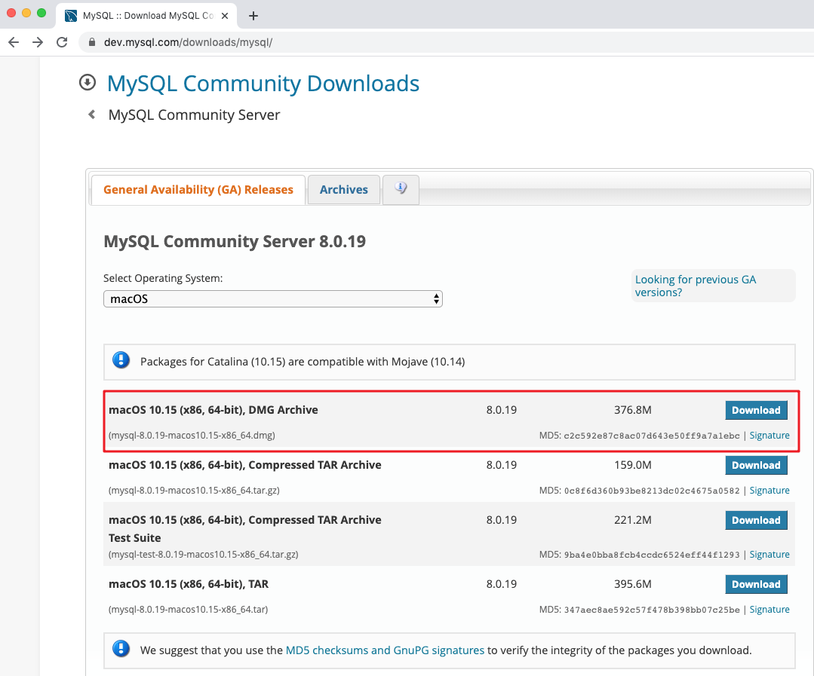
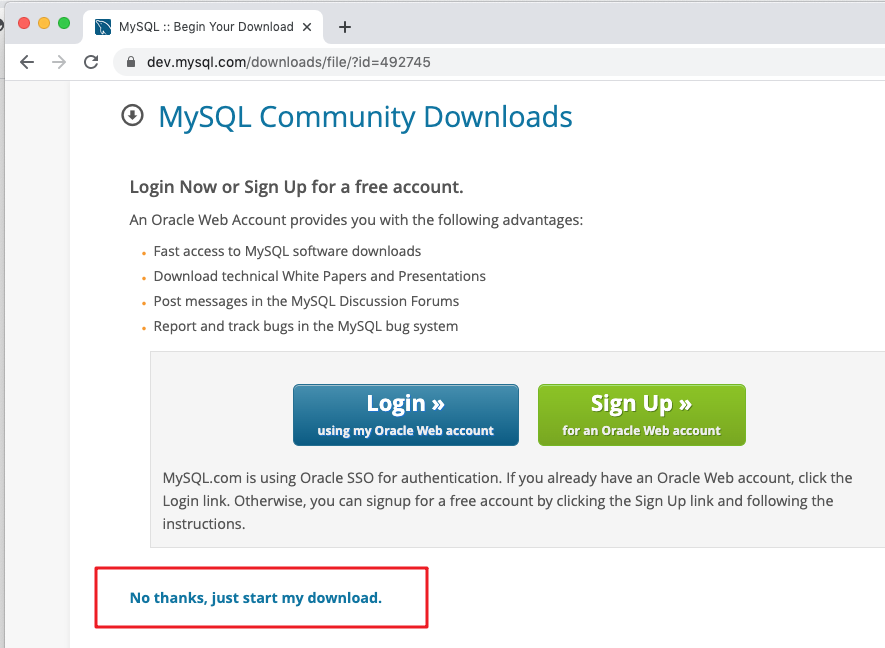
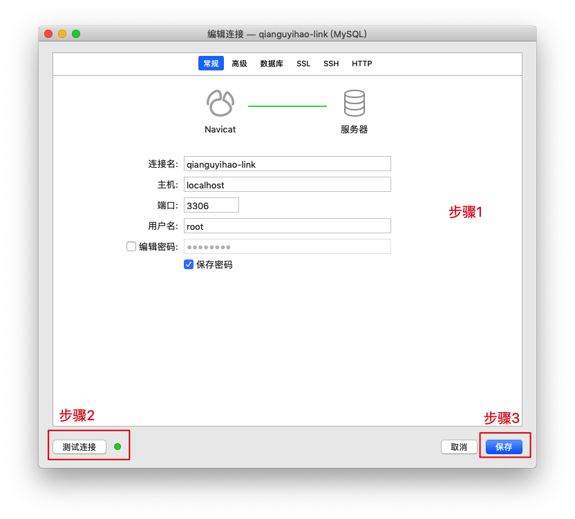
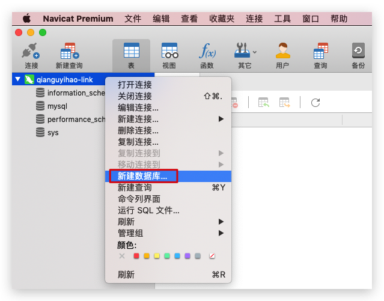
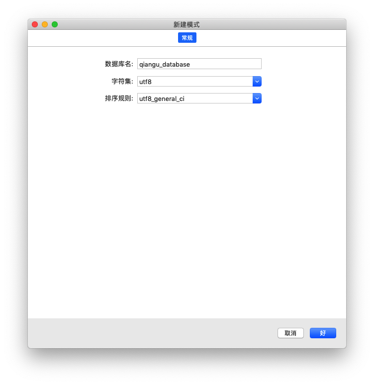
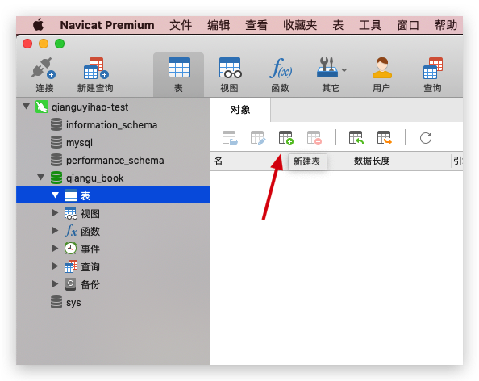
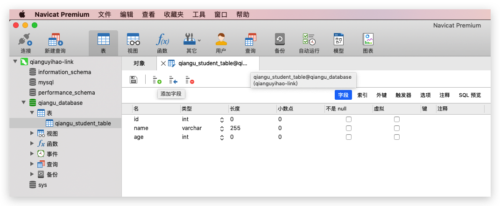
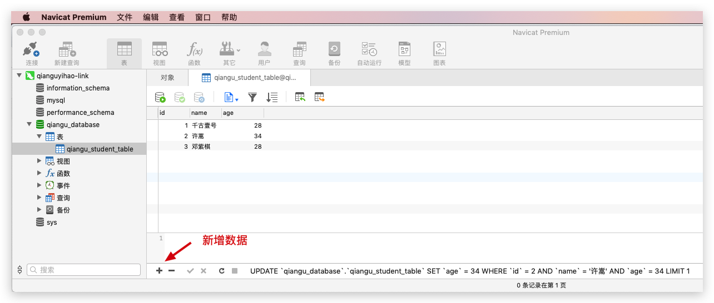

## MySQL 安装

### MySQL（Mac版）

### 步骤1、下载安装包并安装：

MySQL 下载地址：https://dev.mysql.com/downloads/mysql/







#### 步骤2、配置环境变量

打开 `~/.bash_profile` 文件，在文件的末尾，添加如下内容，即可配置环境变量：

```bash
# mysql
export PATH=${PATH}:/usr/local/mysql/bin
#快速启动、结束MySQL服务, 可以使用alias命令
alias mysqlstart='sudo /usr/local/mysql/support-files/mysql.server start'
alias mysqlstop='sudo /usr/local/mysql/support-files/mysql.server stop'
```

配置好环境变量后，在终端输入 `source ~/.bash_profile` 命令，让配置生效。

在终端的任何位置，输入如下命令，即可进入 mysql 命令的执行窗口：

```sql
mysql -u root -p
```

参考链接：

- [MySQL安装（Mac版）](https://juejin.im/post/5cc2a52ce51d456e7079f27f)

### 步骤3、继续配置环境变量

在 `~/.bash_profile` 中配置好环境变量后，发现每次重启终端后，配置都会失效，需要重新执行 `source ~/.bash_profile` 命令。

原因是，zsh加载的是 `~/.zshrc`文件，而 `.zshrc` 文件中并没有定义任务环境变量。

解决办法：打开 `~/.zshrc` 文件，在文件的末尾，添加如下内容即可：

```bash
source ~/.bash_profile
```

参考链接：<https://blog.csdn.net/science_Lee/article/details/79214127>

## Navicat Premium 软件初体验

Navicat Premium 软件是一种数据库管理的GUI软件，采用可视化的方式来查看和操作数据库，非常方便。支持的数据库有： MySQL、MongoDB、SQL Server、SQLite、Oracle 及 PostgreSQL等。

安装好 Navicat Premium 软件之后，我们来看看这个软件是怎么用的。

### 新建表和数据

1、新建连接：

打开 Navicat Premium 软件，选择菜单栏「文件-新建连接-mysql」，然后选择如下配置，即可在本地新建一个数据库连接：




2、选中连接后，右键新建数据库：






3、选中数据库之后，新建表 `qiangu_student_table`：




4、在表中添加字段：




5、字段建好后，开始在表中插入数据：




### 导入外部 sql 文件

在 Navicat中，选中当前 database 之后，右键选择“运行sql文件”，即可导入外部sql文件。


